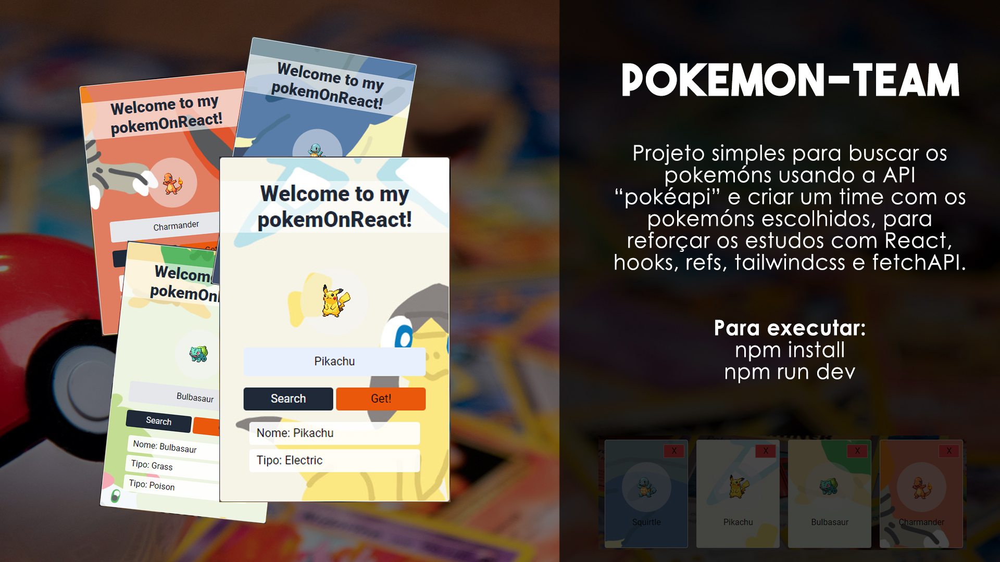

# Pokemón Team

### Sobre o projeto

Projeto simples para buscar os pokemóns usando a API "pokéapi" e criar um time com os pokemóns escolhidos, para reforçar os estudos com React, hooks, refs, tailwindcss e fetchAPI.

### Para executar:
npm install
npm run dev